<!-- Header Wave -->

<!-- Typing SVG -->

 

## 💫 About Me

🚀 **Full-Stack Developer** | **Python Programmer** | **Open Source Enthusiast**  

| 🎯 Current Focus | 👤 Background & Philosophy |
| :--- | :--- |
| 🌱 **Building:** Scalable web apps with Next.js, Prisma, PostgreSQL | 🚀 **Role:** Full-Stack Developer & Python Programmer |
| 📚 **Learning:** Advanced System Design & Cloud Architecture | 🎓 **Education:** B.Tech CSE @ Axis Institute of Technology |
| 🤝 **Collaborating:** Open Source Projects & Hackathons | 📌 **Philosophy:** Code, Build, Learn, Repeat. |

## 🌐 Socials

## 🚀 Featured Projects

  
  &nbsp;&nbsp;&nbsp;
  

## 💻 Tech Stack

## 📊 GitHub Stats

  
  &nbsp;
  

 

  

## ✍️ Random Dev Quote

  

<!-- Footer Wave -->

